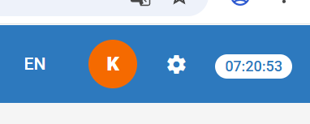
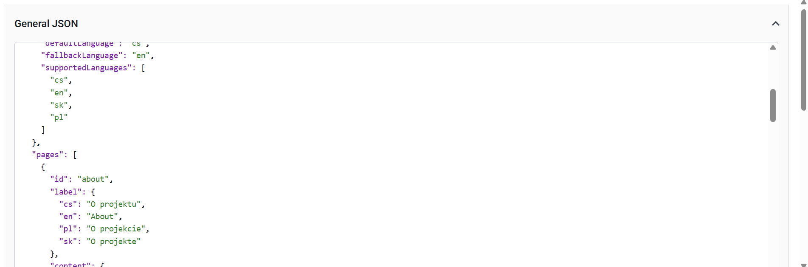
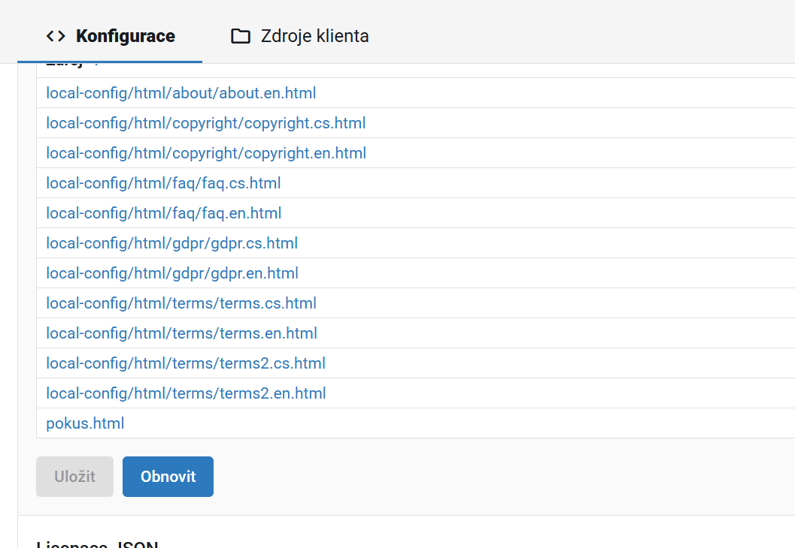
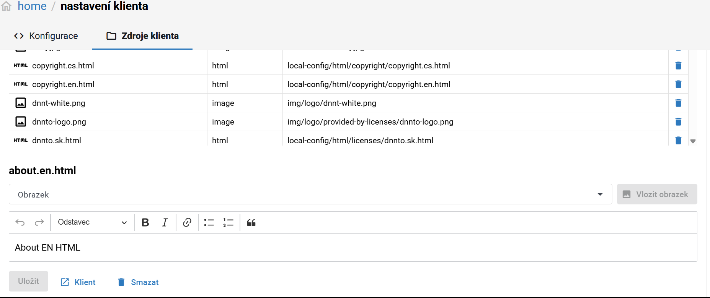

[Úvod](../../../index.md) > [Návody](../../../guides/index.md) / [Kurátor](../../curator/index.md) / [Úlohy](index.md)

# Konfigurace Web klienta

Konfiguruje se Web klient a jeho zdroje (resources)

---

## Postup

1. Otevřete **Admin klienta**
2. Přejděte do sekce **Nastavení klienta**
3. Zobrazí se záložky:
    - tab **Konfigurace**
    - tab **Zdroje klienta**

   

---

### Konfigurace

V této sekci se konfigurují základní 3 části konfigurace web klienta:

- [Hlavní konfigurační soubor](https://github.com/ceskaexpedice/kramerius-web-client-v3/wiki/Hlavn%C3%AD-konfigura%C4%8Dn%C3%AD-soubor)
- [Konfigurace úvodní strany](https://github.com/ceskaexpedice/kramerius-web-client-v3/wiki/Konfigurace-%C3%BAvodn%C3%AD-strany)
- [Konfigurace licencí](https://github.com/ceskaexpedice/kramerius-web-client-v3/wiki/Konfigurace-licenc%C3%AD)

Vkládá se JSON formát. Jako hodnoty některých polí je možno použít odkaz - např. pokud se má použít nějaký custom html jako je informační
stránka. Tyto části se potom ukládají jako Zdroje klienta a editují se zvlášť:

---

### Zdroje klienta

Zdrojem múže být html nebo obrázek. Zdroje se ukládají pomocí REST API do databáze jádra

---

